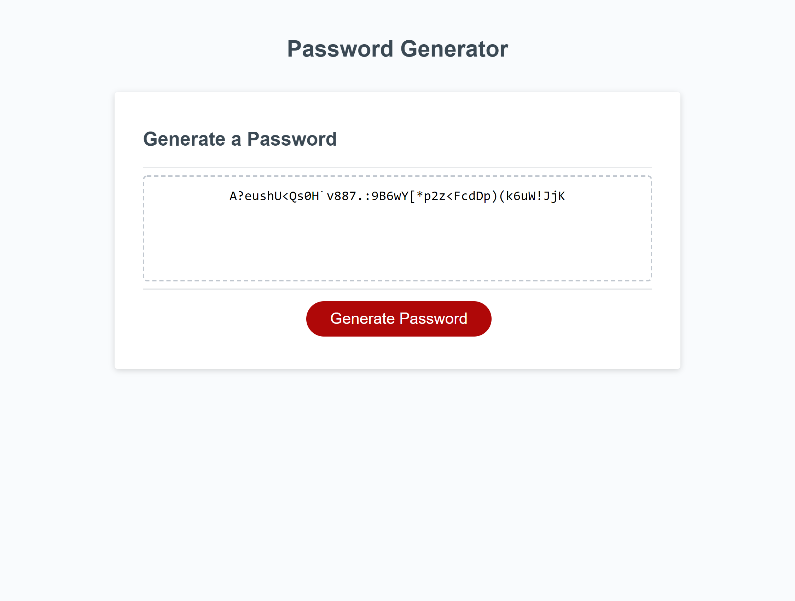

# Password Generator

## Table of Contents

- [Password Generator](#password-generator)
  - [Table of Contents](#table-of-contents)
  - [Github Pages URL](#github-pages-url)
  - [Description](#description)
    - [What Was Done](#what-was-done)
  - [Getting Started](#getting-started)
  - [Screenshots](#screenshots)
    - [Pre-Password Generator](#pre-password-generator)
    - [Post-Password Generator](#post-password-generator)

## Github Pages URL

[Click here](https://soumeyah.github.io/password_generator/) for link to github pages deployed website.

## Description

We were given starter code to modify so that the application generated a random password in the browser based on the criteria that the user selected.

### What Was Done

- Once the generate button is clicked the password should be written to the page and not console logged.
- The password created should be based on criteria the user selected
  - The length of the password should be a number between 8 and 128 characters inclusive that the user selected.
  - The password should contain at least one of the following:
    - Numbers
    - Lowercase letters
    - Uppercase letters
    - Special characters
- To accomplish this we used declarative functional code.
- Functions were created to handle individual tasks such as prompting the user for a password length, validating the password length, prompting the user for characters etc.
- The user inputs were collected using prompt and confirms.
- The choices of characters were stored in an array that was shuffled using the Fisher-Yates shuffle to make sure to randomize as much as possible.
- The Javascript code was formatted using lint (prettier).

In the future to ensure that the randomized password always contains the user selected characters, especially when the password length is shorter, I would change the array that stores the options from being a single array with all the elements shuffled inside to an array of arrays. That randomly chooses between the arrays (numbers, lowercase, uppercase, special characters) before then randomly choosing an element from inside an array.

## Getting Started

- Clone GitHub project (repository password_generator) to your local machine.
- Navigate into project and open in VSCode.
- Open the index.html file in broswer preferably.

git clone git@github.com:SoumeyaH/password_generator.git

cd password_generator

code .

## Screenshots

### Pre-Password Generator

### Post-Password Generator

